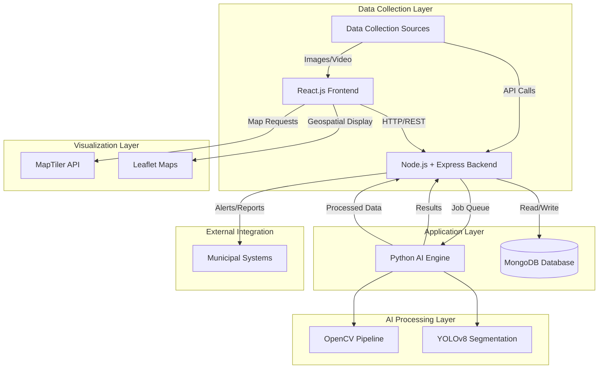

# Design Document: Automated Road Condition Analyzer

## Overview

The Automated Road Condition Analyzer is a distributed system that combines computer vision, geospatial analysis, and web technologies to provide real-time road infrastructure monitoring. The system processes visual data through an AI pipeline to detect and classify road conditions, then presents actionable insights through an intuitive web interface with integrated mapping capabilities.

The architecture follows a modular microservices approach, separating concerns between data collection, AI processing, storage, and presentation layers. This design enables independent scaling, technology optimization per component, and flexible deployment options for different municipal environments.

## Architecture

### High-Level System Architecture



### Component Responsibilities

#### 1. Frontend (React.js Web Interface)
**Primary Responsibilities:**
- **User Interface Management**: Provides intuitive interface for uploading road imagery and video files
- **Data Visualization**: Renders analysis results, condition reports, and trend analytics
- **Geospatial Display**: Integrates with mapping services to show road conditions geographically
- **Real-time Updates**: Displays live processing status and immediate alerts for critical conditions
- **Export Functionality**: Enables users to export reports in various formats (PDF, CSV, JSON)

**Key Features:**
- Drag-and-drop file upload with progress tracking
- Interactive dashboard with filtering and search capabilities
- Real-time notification system for critical road conditions
- Responsive design for desktop and mobile access
- Role-based access control for different stakeholder types

#### 2. Backend (Node.js + Express.js API)
**Primary Responsibilities:**
- **API Gateway**: Serves as central orchestration point for all system interactions
- **File Management**: Handles upload, validation, and temporary storage of imagery data
- **Job Orchestration**: Manages AI processing queue and coordinates between components
- **Data Integration**: Aggregates results from AI engine and stores in database
- **Authentication & Authorization**: Manages user access and permissions
- **External Integration**: Provides APIs for municipal system integration

**Key Features:**
- RESTful API endpoints for all system operations
- Asynchronous job processing with status tracking
- File validation and preprocessing before AI analysis
- Webhook support for real-time notifications
- Rate limiting and security middleware

#### 3. AI Engine (Python Computer Vision Pipeline)
**Primary Responsibilities:**
- **Image Processing**: Preprocesses uploaded imagery for optimal analysis
- **Defect Detection**: Uses YOLOv8 segmentation to identify road surface defects
- **Condition Classification**: Categorizes detected issues by type and severity
- **Quality Assessment**: Validates input data quality and analysis confidence
- **Continuous Learning**: Incorporates feedback to improve detection accuracy

**Technical Components:**
- **OpenCV Pipeline**: Handles image preprocessing, enhancement, and standardization
- **YOLOv8 Segmentation Model**: Custom-trained model for road defect detection
- **Post-processing Logic**: Filters results, calculates confidence scores, and prioritizes findings
- **Batch Processing**: Handles multiple images efficiently with parallel processing

#### 4. Database (MongoDB)
**Primary Responsibilities:**
- **Analysis Results Storage**: Stores processed condition assessments with metadata
- **Historical Data Management**: Maintains time-series data for trend analysis
- **Geospatial Indexing**: Enables efficient location-based queries and mapping
- **User Management**: Stores user profiles, permissions, and preferences
- **System Configuration**: Maintains processing parameters and model configurations

**Data Models:**
- Road segments with geographic boundaries and condition history
- Analysis results with timestamps, confidence scores, and defect classifications
- User accounts with role-based permissions and notification preferences
- Processing jobs with status tracking and error logging

#### 5. Mapping Integration (MapTiler API + Leaflet)
**Primary Responsibilities:**
- **Base Map Rendering**: Provides high-quality street maps and satellite imagery
- **Geospatial Visualization**: Overlays road condition data on interactive maps
- **Location Services**: Enables address search and coordinate conversion
- **Custom Styling**: Applies condition-based color coding and symbology
- **Performance Optimization**: Implements tile caching and efficient rendering

## Data Flow Architecture

### 1. Data Ingestion Flow
```
Image Upload → Frontend Validation → Backend API → File Storage → AI Processing Queue
```

**Process:**
1. Users upload road imagery through React interface
2. Frontend validates file types, sizes, and basic metadata
3. Backend API receives files and performs additional validation
4. Files stored temporarily with unique identifiers
5. Processing jobs queued for AI engine with priority levels

### 2. AI Processing Flow
```
Queued Job → Image Preprocessing → YOLOv8 Analysis → Result Validation → Database Storage
```

**Process:**
1. AI engine retrieves queued processing jobs
2. OpenCV pipeline preprocesses images (resize, enhance, normalize)
3. YOLOv8 model performs segmentation and defect detection
4. Post-processing validates results and calculates confidence scores
5. Structured results returned to backend for database storage

### 3. Visualization Flow
```
Database Query → Backend API → Frontend Processing → Map Integration → User Display
```

**Process:**
1. Frontend requests condition data based on user filters
2. Backend queries MongoDB with geospatial and temporal parameters
3. Results formatted and returned via REST API
4. Frontend processes data for map visualization
5. MapTiler provides base maps while Leaflet renders condition overlays

### 4. Alert and Integration Flow
```
Critical Detection → Immediate Notification → External System Integration → Stakeholder Alerts
```

**Process:**
1. AI engine identifies critical road conditions
2. Backend immediately generates alerts and notifications
3. Webhook calls sent to integrated municipal systems
4. Email/SMS notifications dispatched to relevant stakeholders

## Modular Separation Benefits

### 1. Technology Optimization
- **Frontend**: React.js optimized for responsive user interfaces and real-time updates
- **Backend**: Node.js provides excellent I/O performance for API orchestration and file handling
- **AI Engine**: Python leverages extensive computer vision libraries and ML frameworks
- **Database**: MongoDB's document structure ideal for varied analysis results and geospatial data

### 2. Independent Development and Deployment
- Teams can work on different components simultaneously without conflicts
- Each component can be updated, tested, and deployed independently
- Different release cycles possible for each component based on requirements
- Technology stack changes can be made to individual components without system-wide impact

### 3. Fault Isolation and Reliability
- Failure in one component doesn't necessarily bring down the entire system
- AI processing issues don't affect user interface or data access
- Database problems don't prevent new image uploads or basic interface functionality
- Graceful degradation possible when individual services are unavailable

### 4. Security and Access Control
- Different security requirements can be applied to each component
- AI processing can run in isolated environment with restricted access
- Database access controlled through backend API layer
- Frontend security focused on user authentication and input validation

## Scalability Advantages

### 1. Horizontal Scaling Capabilities
- **Frontend**: Can be deployed to CDN for global distribution and caching
- **Backend API**: Multiple instances can run behind load balancer for increased throughput
- **AI Engine**: Processing can be distributed across multiple GPU-enabled machines
- **Database**: MongoDB supports sharding for large-scale data distribution

### 2. Performance Optimization
- **Asynchronous Processing**: AI analysis doesn't block user interface operations
- **Caching Strategies**: Map tiles, analysis results, and API responses can be cached independently
- **Queue Management**: Processing jobs can be prioritized and distributed based on system load
- **Resource Allocation**: Each component can be allocated resources based on specific needs

### 3. Load Distribution Patterns
- **Peak Upload Handling**: Backend can queue processing jobs during high upload periods
- **Geographic Distribution**: AI processing can be distributed across regions for faster response
- **Temporal Load Balancing**: Historical analysis can be scheduled during off-peak hours
- **Component-Specific Scaling**: Scale only the components experiencing high demand

### 4. Future Expansion Capabilities
- **Additional AI Models**: New detection algorithms can be integrated without frontend changes
- **Multiple Data Sources**: System can accommodate various input types (drone imagery, vehicle cameras)
- **Enhanced Integrations**: New municipal systems can be integrated through backend APIs
- **Advanced Analytics**: Additional processing components can be added for predictive analysis

## Components and Interfaces

### API Specifications

#### Upload Endpoint
```
POST /api/upload
Content-Type: multipart/form-data
Body: {
  files: [File],
  location: {lat: number, lng: number},
  metadata: {timestamp: string, source: string}
}
Response: {jobId: string, status: string, estimatedCompletion: string}
```

#### Results Endpoint
```
GET /api/results?location={lat,lng}&radius={meters}&timeRange={start,end}
Response: {
  results: [{
    id: string,
    location: {lat: number, lng: number},
    conditions: [{type: string, severity: string, confidence: number}],
    timestamp: string,
    imageUrl: string
  }]
}
```

#### Status Endpoint
```
GET /api/status/{jobId}
Response: {
  jobId: string,
  status: "queued|processing|completed|failed",
  progress: number,
  results?: object,
  error?: string
}
```

### Database Schema Design

#### Road Segments Collection
```javascript
{
  _id: ObjectId,
  geometry: {
    type: "LineString",
    coordinates: [[lng, lat], [lng, lat]]
  },
  properties: {
    roadName: string,
    roadType: string,
    municipality: string,
    lastInspected: Date,
    currentCondition: {
      overall: string,
      defects: [DefectObject]
    }
  }
}
```

#### Analysis Results Collection
```javascript
{
  _id: ObjectId,
  jobId: string,
  location: {
    type: "Point",
    coordinates: [lng, lat]
  },
  analysis: {
    detectedDefects: [{
      type: string,
      severity: string,
      confidence: number,
      boundingBox: [number],
      area: number
    }],
    overallCondition: string,
    processingTime: number,
    modelVersion: string
  },
  metadata: {
    imageUrl: string,
    uploadedBy: string,
    processedAt: Date,
    source: string
  }
}
```

## Data Models

### Core Data Structures

#### Road Condition Assessment
```typescript
interface ConditionAssessment {
  id: string;
  location: GeoPoint;
  timestamp: Date;
  overallCondition: 'excellent' | 'good' | 'fair' | 'poor' | 'critical';
  defects: Defect[];
  confidence: number;
  imageMetadata: ImageMetadata;
}

interface Defect {
  type: 'pothole' | 'crack' | 'wear' | 'debris' | 'marking_fade';
  severity: 'minor' | 'moderate' | 'major' | 'critical';
  area: number; // square meters
  confidence: number;
  boundingBox: BoundingBox;
  repairPriority: number;
}
```

#### Processing Job
```typescript
interface ProcessingJob {
  id: string;
  status: 'queued' | 'processing' | 'completed' | 'failed';
  priority: number;
  submittedAt: Date;
  startedAt?: Date;
  completedAt?: Date;
  inputFiles: string[];
  results?: ConditionAssessment[];
  error?: string;
  estimatedCompletion: Date;
}
```

## Correctness Properties

*A property is a characteristic or behavior that should hold true across all valid executions of a system—essentially, a formal statement about what the system should do. Properties serve as the bridge between human-readable specifications and machine-verifiable correctness guarantees.*

### Property 1: Defect Detection and Classification
*For any* road imagery input containing detectable defects, the system should identify the defects and assign valid severity levels with appropriate prioritization based on safety impact and repair urgency.
**Validates: Requirements 1.1, 1.2, 1.3**

### Property 2: Processing Time Compliance
*For any* road imagery processing request, the system should generate standardized condition reports within 30 seconds per road segment.
**Validates: Requirements 1.5**

### Property 3: Database Update Timeliness
*For any* new condition data generated by the AI engine, the road condition database should be updated within 5 minutes of data availability.
**Validates: Requirements 2.2**

### Property 4: Critical Condition Alerting
*For any* detected critical road condition, the system should immediately generate alerts to all relevant departments without delay.
**Validates: Requirements 2.3**

### Property 5: Error Handling Continuity
*For any* data processing failure, the system should log the error details and continue processing subsequent data without interruption.
**Validates: Requirements 2.5**

### Property 6: Comprehensive Reporting
*For any* report generation request, the system should provide condition summaries organized by geographic area, severity, and time period, with export capabilities in the requested format (CSV, JSON, PDF).
**Validates: Requirements 3.1, 3.3**

### Property 7: Stakeholder Notification
*For any* significant condition change detected in the road network, the system should automatically notify all relevant stakeholders through configured channels.
**Validates: Requirements 3.5**

### Property 8: Network Coverage Expansion
*For any* new road added to the municipal network, the system should automatically include it in monitoring coverage without manual intervention.
**Validates: Requirements 4.2**

### Property 9: Concurrent Processing Capability
*For any* set of simultaneous data processing requests from multiple collection sources, the system should handle all requests correctly without data corruption or processing conflicts.
**Validates: Requirements 4.3**

### Property 10: Coverage Map Completeness
*For any* coverage map request, the system should display monitoring status and data recency information for all road segments within the requested area.
**Validates: Requirements 4.5**

### Property 11: Data Quality Validation
*For any* imagery input, the system should validate data quality against minimum standards, reject substandard images, cross-reference assessments with historical data for anomaly detection, and flag low-confidence assessments for manual review.
**Validates: Requirements 5.1, 5.2, 5.3**

### Property 12: Audit Trail Completeness
*For any* condition assessment or system decision, the system should maintain complete audit trails with timestamps, user information, and decision rationale.
**Validates: Requirements 5.4**

## Error Handling

### Input Validation and Error Recovery
- **Image Quality Validation**: Reject images that don't meet minimum resolution, format, or clarity standards
- **Geolocation Validation**: Verify coordinates are within municipal boundaries and reasonable accuracy
- **File Size and Format Limits**: Enforce upload limits and supported file types
- **Graceful Degradation**: Continue processing other jobs when individual analyses fail

### AI Processing Error Handling
- **Model Confidence Thresholds**: Flag results below confidence levels for manual review
- **Processing Timeouts**: Handle cases where AI analysis exceeds expected duration
- **Resource Management**: Prevent memory leaks and manage GPU resources effectively
- **Fallback Mechanisms**: Use alternative processing methods when primary AI models fail

### System Integration Error Handling
- **Database Connection Failures**: Implement retry logic and connection pooling
- **External API Failures**: Handle MapTiler and municipal system integration failures gracefully
- **Network Connectivity Issues**: Queue operations for retry when network is restored
- **Authentication and Authorization Errors**: Provide clear error messages and secure fallbacks

## Testing Strategy

### Dual Testing Approach
The system requires both unit testing and property-based testing to ensure comprehensive coverage:

**Unit Tests**: Verify specific examples, edge cases, and error conditions including:
- Specific defect detection examples with known ground truth
- Integration points between frontend, backend, and AI components
- Edge cases like empty uploads, malformed data, and boundary conditions
- Error conditions such as network failures and invalid inputs

**Property Tests**: Verify universal properties across all inputs including:
- Universal properties that hold for all road imagery inputs
- Comprehensive input coverage through randomization of test data
- System behavior validation across different load conditions
- Data consistency properties across all processing operations

### Property-Based Testing Configuration
- **Minimum 100 iterations** per property test due to randomization requirements
- **Testing Framework**: Use fast-check for JavaScript components and Hypothesis for Python AI engine
- **Test Tagging**: Each property test must reference its design document property using format:
  **Feature: road-condition-analyzer, Property {number}: {property_text}**
- **Coverage Requirements**: Each correctness property must be implemented by a single property-based test
- **Integration Testing**: Property tests should validate end-to-end system behavior where possible

### Testing Environment Requirements
- **Test Data Sets**: Curated collection of road imagery with known defects and conditions
- **Mock Services**: Simulated external APIs for MapTiler and municipal system integration
- **Performance Testing**: Load testing for concurrent processing and scalability validation
- **Security Testing**: Validation of authentication, authorization, and data protection measures
